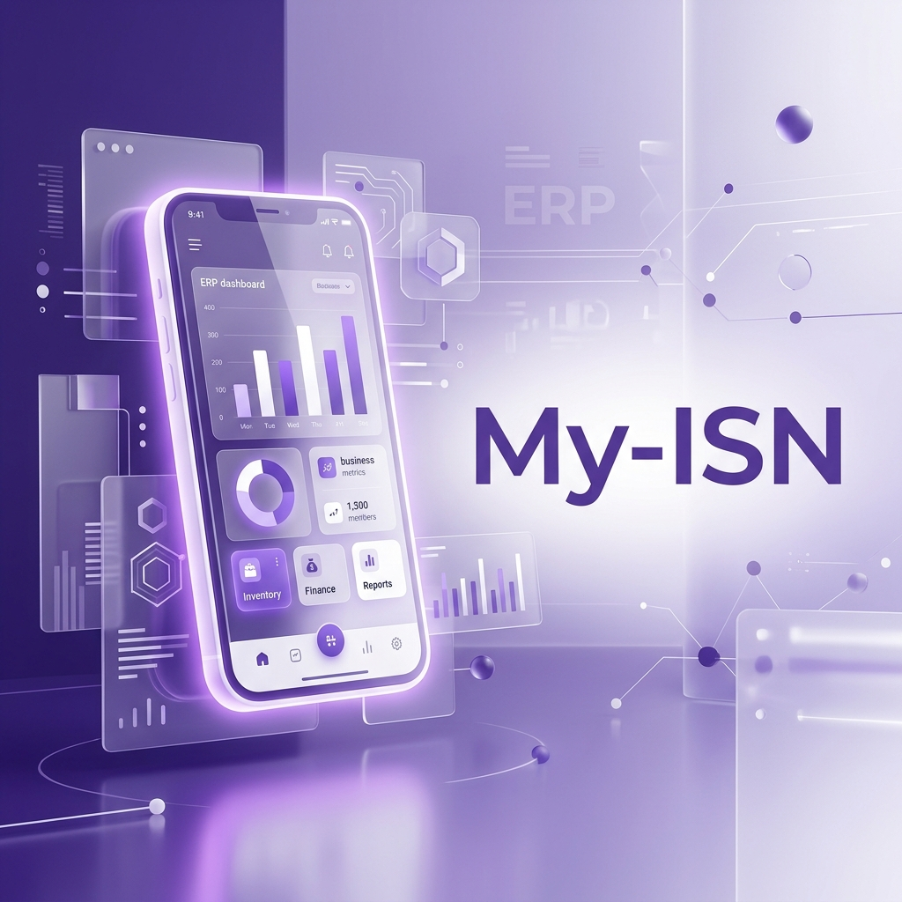

    

    
    
    
    

**Bangun ekosistem ERP mobile yang cerdas, cepat, dan profesional.**

Dengan fondasi Flutter yang solid dan antarmuka yang dipoles sedemikian rupa, My-ISN memungkinkan tim Anda fokus pada apa yang membuat operasional perusahaan menjadi efisien. My-ISN menghadirkan komponen UI premium yang adaptif seiring dengan bertambahnya kompleksitas kebutuhan perusahaan.

- **Manajemen Keuangan** — Kelola arus kas, saldo, dan laporan finansial dengan akurasi tinggi dan tampilan yang intuitif.
- **Produktivitas Tim** — Delegasikan tugas, pantau kolaborasi, dan sinkronkan laporan kerja dalam satu platform terpadu.
- **Asisten AI Cerdas** — Manfaatkan kemampuan Google Gemini untuk menjawab pertanyaan operasional dan prosedur secara real-time.
- **Manajemen Aset** — Pantau penyewaan laptop, histori pemakaian, dan penyimpanan dokumen di awan secara aman.
- **Helpdesk Terpadu** — Tangani kendala teknis dan administrasi dengan sistem tiket yang ringkas dan efisien.
- **Lokalisasi Dinamis** — Dukungan antarmuka multi-bahasa yang memastikan pengalaman pengguna konsisten bagi semua karyawan.

[Lihat Changelog](CHANGELOG.md)

---

## Berbagi Kontribusi

Silakan pelajari panduan kontribusi internal kami untuk menjaga standar kualitas kode yang tinggi.

## Butuh Bantuan?

Jika Anda menemukan bug, silakan ajukan laporan detail sesuai prosedur dan tunggu bantuan dari tim pengembang.

Jika Anda memiliki pertanyaan atau saran fitur baru, silakan gunakan saluran komunikasi internal yang telah disediakan. Kami mengapresiasi setiap masukan untuk pengembangan yang lebih baik.

Jika Anda menemukan celah keamanan, mohon segera hubungi administrator sistem melalui jalur privat.
