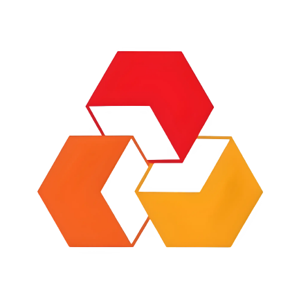

    

<h1 align="center">My-ISN Mobile ERP</h1>

<strong>Sistem Integrasi Operasional Perusahaan Generasi Terbaru</strong>

    
    
    
    
    

    
    

    

---

## Deskripsi Produk

My-ISN adalah solusi Enterprise Resource Planning (ERP) berbasis mobile yang dirancang khusus untuk memodernisasi alur kerja administratif dan operasional perusahaan. Dengan mengadopsi standar desain **Flat Premium**, aplikasi ini memastikan pengalaman pengguna yang intuitif, cepat, dan terorganisir, memungkinkan tim fokus pada pertumbuhan bisnis inti dengan minimalisasi hambatan teknis.

## Dukungan Multi-Persona

Aplikasi ini dikembangkan untuk melayani dua entitas utama dengan fungsionalitas yang dikustomisasi:

*   **Internal Staff (ERP)**: Fokus pada manajemen tugas, keuangan perusahaan, aset internal, dan kolaborasi tim.
*   **Customer (E-commerce & Rental)**: Portal bagi pengguna umum untuk melakukan penyewaan laptop dan pembelian produk perusahaan secara digital (saat ini sedang dalam tahap pengembangan intensif).

## Pilar Utama Aplikasi

Aplikasi ini dibangun di atas tiga pilar utama untuk menunjang kebutuhan korporasi:

1.  **Integritas Data**: Sinkronisasi real-time antar departemen guna memastikan keakuratan informasi finansial dan aset.
2.  **Keamanan Berlapis**: Implementasi Role-Based Access Control (RBAC) yang ketat dan enkripsi data end-to-end.
3.  **Skalabilitas UI**: Desain sistem yang konsisten dan adaptif terhadap penambahan modul fungsional baru tanpa mengorbankan performa.

---

## Ekosistem Fitur

### 01. Financial Control Center
*   **Cash Flow Monitoring**: Pemantauan arus kas masuk dan keluar secara detil.
*   **Balance Management**: Rekonsiliasi saldo otomatis untuk transparansi keuangan yang maksimal.
*   **Automated Reporting**: Laporan finansial harian dan bulanan yang siap saji.

### 02. Workforce Productivity
*   **Collaborative Todo List**: Manajemen tugas tim dengan fitur delegasi dan prioritas.
*   **Worklog Synchronization**: Pelaporan durasi dan hasil kerja yang terintegrasi langsung dengan jadwal harian.
*   **Performance Tracking**: Metrik produktivitas untuk mendukung evaluasi kinerja yang objektif.

### 03. Asset & Infrastructure
*   **Inventory Tracking**: Manajemen siklus hidup aset perusahaan (terutama perangkat laptop).
*   **Secure Document Vault**: Penyimpanan dokumen legal dan operasional (PO, KTP, Kontrak) secara digital dan terpusat.
*   **Historical Usage**: Rekam jejak pemakaian aset untuk optimalisasi pemeliharaan.

### 04. Unified Helpdesk
*   **Incident Management**: Pelaporan kendala teknis dengan sistem tiket yang ringkas.
*   **Priority Routing**: Penanganan masalah berdasarkan tingkat urgensi yang terukur.
*   **Communication Bridge**: Antarmuka interaksi langsung antara user dan tim pendukung teknis.

---

## Karakteristik Teknis
*   **Cross-Platform Performance**: Dibangun dengan Flutter untuk performa native yang mulus di berbagai perangkat.
*   **Modern Localization**: Sistem multi-bahasa (ID/EN) yang menyesuaikan dengan preferensi pengguna secara dinamis.
*   **Offline Capability**: Sinkronisasi data yang cerdas untuk memastikan fungsionalitas tetap terjaga meski dalam kondisi jaringan tidak stabil.

---

## Navigasi Dokumentasi
Informasi teknis lebih lanjut terkait pengembangan dapat diakses melalui:
*   [Riwayat Perubahan (Changelog)](docs/CHANGELOG.md)
*   [Panduan Kontribusi Pengembang](docs/CONTRIBUTING.md)
*   [Dokumentasi API Internal](docs/API.md)

---

    <strong>PT. ISKOM SARANA NUSANTARA</strong> 
    Copyright © 2026. All Rights Reserved.  
    Architected and Developed by <a href="https://github.com/SukaMCD"><strong>SukaMCD</strong></a>

